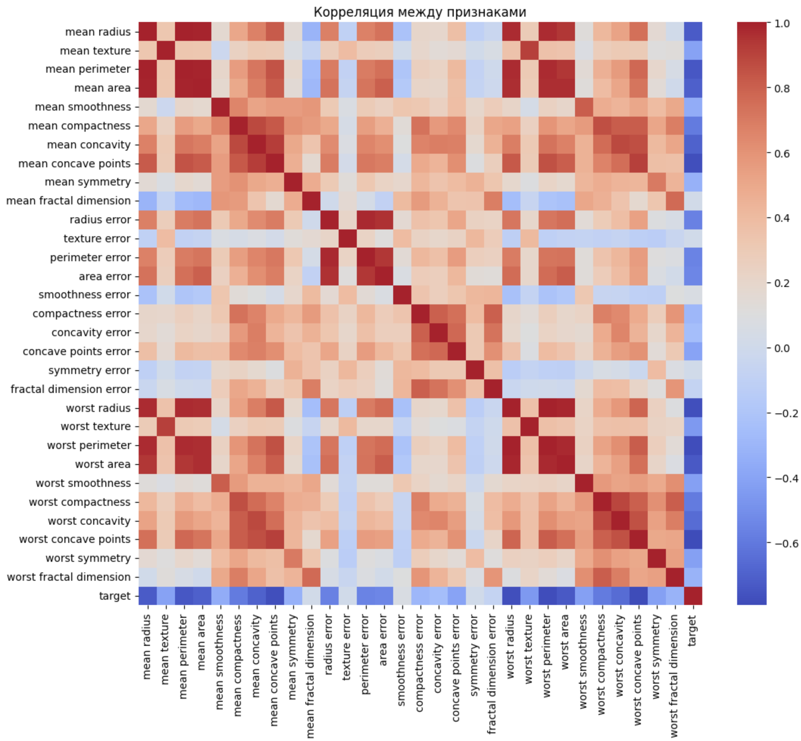

# 🧬 Breast Cancer Classification (Scikit-learn)

This project demonstrates a complete classification pipeline using the **Breast Cancer Wisconsin Diagnostic dataset**, built with Python and Scikit-learn. The goal is to distinguish between **malignant** and **benign** tumors based on real-world medical data.

## 📁 Project Structure

- `breast_cancer_classification.ipynb` — Colab notebook with full code and explanations
- `images/` — visualizations (confusion matrix, heatmap, etc.)
- `README.md` — project documentation

## 📊 Visualizations

### 🔥 Correlation Heatmap

This heatmap shows the correlation between all numeric features in the dataset.  
Dark red = strong positive correlation.  
Dark blue = strong negative correlation.



---

### 📈 Feature Distribution: Mean Radius by Class

This histogram shows how the feature `mean radius` is distributed across malignant and benign tumors.  
- Blue (0) = Malignant  
- Orange (1) = Benign

This feature is highly predictive and demonstrates class separation.


---

## ⚙️ Algorithms Used

- K-Nearest Neighbors (KNN)
- Logistic Regression
- Stochastic Gradient Descent (SGDClassifier)

## 🔍 Evaluation Metrics

- **Accuracy**
- **Precision**
- **Recall**
- **F1-score**
- **Confusion Matrix**

## 🔄 Cross-Validation

Each model was also evaluated using 5-fold cross-validation to ensure stable and reliable results.

## 🛠 Technologies

- Python 3
- Pandas, Seaborn, Matplotlib
- Scikit-learn
- Google Colab

## 🚀 How to Use

1. Clone this repository:
   ```bash
   git clone https://github.com/NikitaMarshchonok/breast-cancer-classification.git
